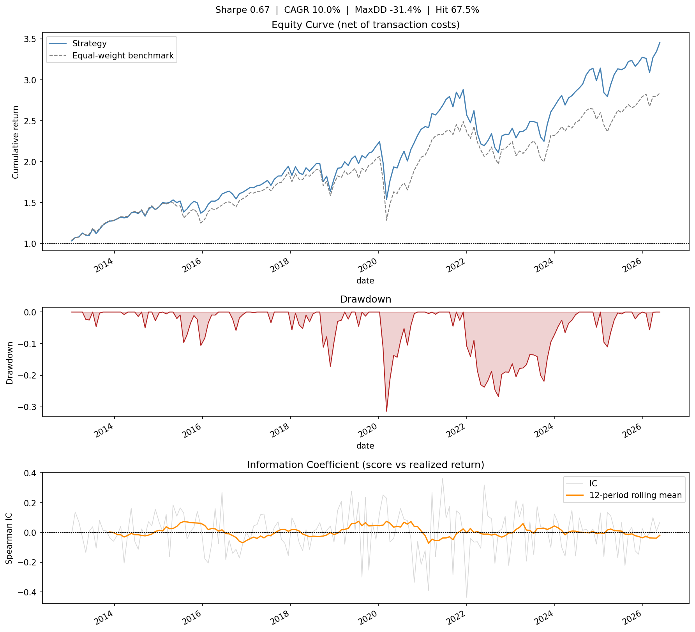

# Equity Signal Engine

[](https://github.com/paulywally123/equity-signal-engine/actions/workflows/tests.yml)

Cross-sectional monthly long-only equity strategy on a point-in-time S&P 500
universe with an overfitting-resistant walk-forward backtest.

## Results (as of latest run)

*Reproduce these exact numbers*: `config/config.yaml` with `universe.mode: full`,
price/fundamentals data snapshot dated 2026-07-08, `python -m src.backtest.build_backtest`.
Numbers will drift on a fresh data pull as prices/fundamentals update.

| Metric | Value |
|---|---|
| Sharpe ratio | **0.665** |
| CAGR | **10.0%** |
| Ann. volatility | 16.5% |
| Max drawdown | -31.4% |
| Hit rate | 67.5% |
| Avg turnover (per rebalance / annualized) | 40.2% / 523% |
| IC (model vs realized) | +0.0050 (t = 0.48) |
| Excess return vs equal-weight BM | +1.46% / yr |
| Backtest period | 2013 – 2026 (169 periods) |
| Universe | Full point-in-time S&P 500 (607 current members, 814 ever-members) |



Strategy: long top-20% by model score, 20-day rebalance, no market-timing
overlay, 10 bps per-side transaction costs. **No short leg** — the long-short
design was the original intent (isolating the cross-sectional signal by
canceling market beta), but shorting costs and hard-to-borrow constraints on
smaller/delisted names aren't modeled in this backtest's data, so long-only is
the more realistic framing given that limitation, at the cost of not cleanly
separating stock-selection skill from market beta. See **Decomposition**
below for how much of the return is attributable to each.

## Decomposition: how much is the model actually contributing?

A long-only, trend-filtered strategy's Sharpe conflates three things: equity
beta over a strong bull period, any market-timing overlay, and the
cross-sectional model. This breaks it apart:

| Configuration | Sharpe | Ann. return | Vol | Max DD | CAGR |
|---|---|---|---|---|---|
| (a) Equal-weight buy-and-hold, no regime, no model | 0.570 | 9.83% | 17.25% | -37.8% | 8.60% |
| (b) Equal-weight + 200d regime filter, no model | 0.472 | 5.35% | 11.33% | -22.5% | 4.80% |
| **(c) Model portfolio, no regime filter (current default)** | **0.665** | **10.97%** | 16.50% | -31.4% | **10.00%** |
| (d) Model + 200d regime filter | 0.471 | 5.41% | 11.50% | -25.3% | 4.84% |

Two things this shows plainly:

1. **The regime filter hurts, in both cases it's applied** — (a)→(b) and
   (c)→(d) both lose Sharpe. It was originally intended as a risk-reducing
   market-timing overlay; once built on a correct equal-weight *return* index
   (see below), it doesn't earn its keep. It's not used by default.
2. **The model beats passive buy-and-hold on this specific historical sample**
   — (c) beats (a) by both Sharpe and absolute return. Whether that's a real,
   generalizable edge or a good draw from noise is a separate question — see
   **Statistical significance** below, where the honest answer is "not
   confidently distinguishable from luck."

**A bug this decomposition surfaced**: the original regime filter averaged
raw *price levels* across the universe (`prices.mean(axis=1)`) rather than
compounding daily *returns* — a price-weighted index, not equal-weighted (a
$500 stock moved it 100x more than a $5 stock for the same % move). Fixed in
`equal_weight_index()` (`src/backtest/backtest.py`). Once fixed, the
200-day window — which happened to sit at the top of its own sensitivity
sweep under the old (buggy) index — no longer looks favorable at any window;
see **Sensitivity summary**.

## Statistical significance: is this distinguishable from luck?

**Momentum-only baseline.** A naive 12-1 month momentum sort (no model, no
fundamentals, no LightGBM) over the identical 169 periods:

| | IC t-stat | Sharpe | CAGR |
|---|---|---|---|
| Momentum-only (single feature) | 0.62 | 0.653 | 9.6% |
| Full model (5 features + LightGBM) | 0.48 | 0.665 | 10.0% |

The entire pipeline — EDGAR fundamentals, feature engineering, walk-forward
LightGBM — earns essentially a rounding error over sorting by trailing
12-month return alone, and has *lower* IC doing it. This is the honest
complexity-vs-payoff comparison an interviewer would run in their head.

**Permutation null test.** Shuffled which ticker gets which predicted score
within each rebalance date (destroying any real score↔outcome relationship
while preserving the cross-sectional and time-series structure), recomputed
IC, repeated 2,000 times to build a null distribution:

| | Value |
|---|---|
| Observed IC mean | +0.0050 |
| Null distribution mean | +0.0001 (centered at ~0, as expected) |
| Null distribution std | 0.0036 |
| **Empirical p-value** (P(null IC ≥ observed)) | **0.089** |
| Observed IC's percentile in the null | 91st |

**This does not clear conventional significance (p < 0.05).** The observed
IC is directionally positive and beats ~91% of random permutations, but a
p-value of 0.089 means we can't confidently rule out that this is a good
draw from noise rather than genuine, generalizable predictive skill. Combined
with the momentum-only comparison above, the fair summary of this whole
project is: **rigorous, correctly-built infrastructure (point-in-time
universe, walk-forward validation, EDGAR integration) surfacing a weak signal
that is suggestive but not statistically confirmed** — not a validated
trading edge.

**Feature selection was in-sample — tested whether fixing that changes the
conclusion; it doesn't.** Both the original 8→5 trim and the earlier Phase 4b
pruning used IC measured over the same 2013–2026 span the backtest reports
performance over. To check the impact, re-derived a feature set using
*only* pre-2020 IC (a proper held-out selection window): under the same
threshold rule, only `mom_12_1` and `roe` survive — `dollar_vol_60`, one of
the 5 currently used, actually shows *negative* IC pre-2020 (t=-0.16) despite
being the strongest feature in the 2020-2026 period (t=1.43). Individual
feature IC is that unstable across sub-periods; several features flip sign
entirely (`mom_1`: t=-2.00 pre-2020 → t=+0.90 after; `rsi_14`: t=-1.96 →
t=+0.93).

Compared honestly on the true 2020-2026 holdout (never used to select either
feature set):

| Feature set | Full-period Sharpe / IC t | Holdout-only Sharpe / IC t |
|---|---|---|
| 5-feature (in-sample selected, current default) | 0.665 / 0.48 | 0.477 / **0.18** |
| 2-feature (honestly selected, pre-2020 only) | 0.627 / 0.22 | 0.426 / **-0.54** |

The honestly-selected set doesn't generalize better — it's worse on the true
holdout. Kept the 5-feature set as the default, since switching doesn't
objectively improve anything measurable. The real conclusion isn't "5 vs 2
features" — it's that the underlying signal is too weak for feature selection
to meaningfully discriminate at all, which is the same conclusion the
permutation test already reached from a different angle.

**New feature tested and rejected: insider trading (Form 4).** Built a
point-in-time panel from SEC's bulk quarterly Form 3/4/5 datasets
(`src/data/insider.py`), filtered to genuine open-market purchases/sales only
(`TRANS_CODE` in `{P, S}` — excludes option exercises, tax withholding,
grants, gifts, which carry no signal about an insider's actual view), using
filing date as the point-in-time availability date (Form 4 has a strict
2-business-day filing deadline, a much tighter lag than the fundamentals
issue fixed earlier). Feature: net buy/sell count ratio over a trailing
90-day window.

Validated with the same held-out methodology as the feature-pruning
investigation above, *before* deciding whether to add it:

| Window | insider_score IC t-stat |
|---|---|
| Selection window (pre-2020) | **-0.32** |
| Holdout (2020-2026) | 0.50 |
| Full period | 0.06 |

Doesn't clear the same bar (|t|≥0.5 on the selection window) applied to every
other feature — the selection-window t-stat is negative. **Not added to the
model.** Deliberately didn't try alternate constructions (different window
lengths, dollar-weighting, restricting to officers/directors) after seeing
this result — iterating until some variant clears the bar is exactly the
in-sample selection problem this section exists to avoid. The panel-building
code and cached data remain in the repo if a differently-motivated
construction is worth testing later, decided in advance rather than reverse-
engineered from a result.

## Phases completed

- [x] **2a** Point-in-time S&P 500 universe (Wikipedia change log, backward reconstruction)
- [x] **2b** Price ingestion + coverage audit (`src/data/prices.py`)
- [x] **2c** Cleaning & membership masking (`src/data/clean.py`)
- [x] **3a** Cross-sectional features — momentum, volatility, RSI, dollar-vol (`src/features/`)
- [x] **3b** Forward return labels with cross-sectional rank normalisation (`src/labels/`)
- [x] **3c** Walk-forward LightGBM model — annual re-fit, no hyperparameter tuning on test data (`src/models/`)
- [x] **3d** Long-only backtest + equity curve report (`src/backtest/`, `src/report/`)
- [x] **4a** SEC EDGAR fundamental data — point-in-time observations, 2007–2026 (`src/data/edgar.py`)
- [x] **4b** Feature pruning; sector-neutral construction (available, not default — costs ~0.54 Sharpe, see Known Limitations on selection methodology)
- [x] **5a** Annual attribution tearsheet + sector exposure + worst/best periods (`src/report/attribution.py`)
- [x] **5b** Sensitivity analysis — top_q, cost assumptions, regime window (`src/backtest/sensitivity.py`)
- [x] **5c** Live signal generation — current ranked portfolio (`src/signal/`)
- [x] **5d** Documentation (this file)
- [x] **6a** Fixed EDGAR filing-date bug — median point-in-time lag was 406 days (89% > 180 days) due to later filings' comparative-period restatements overwriting the original filing date; now 36 days median
- [x] **6b** Trimmed to 5 features with real IC, regularized the LightGBM model — reduced overfitting to the dev-mode ticker subset (train/test gap 2.7x → 1.2x on a matched liquidity slice)
- [x] **6c** Fixed regime index (price-weighted → equal-weight return) and dropped the regime filter given the decomposition above
- [x] **6d** Fixed live signal generation always lagging ~1 rebalance cycle behind reality regardless of data freshness (`predict_latest()` in `src/models/model.py`)
- [x] **6e** Alpaca paper-trading integration (`src/trading/`) — dry-run by default, equal-weight rebalance to the model's top-N
- [x] **6f** Fixed walk-forward embargo gap — see Key design decisions
- [x] **6g** Dev-mode robustness test against random 100-ticker subsets — see Dev mode section
- [x] **6h** Momentum-only baseline and permutation null test — see Statistical significance
- [x] **6i** Investigated in-sample feature pruning via held-out selection window — see Statistical significance
- [x] **6j** Multi-strategy/multi-account paper trading — momentum-only baseline running in parallel with the full model, on separate Alpaca accounts (`--strategy`/`--account` in `src/trading/`)
- [x] **6k** Built and tested an insider-trading (Form 4) feature; rejected after held-out validation — see Statistical significance

## Feature set (5 features, all rank-normalised cross-sectionally)

Started at 8; `mom_3`, `mom_1`, `rsi_14` were excluded from training from the
start (negative individual IC). `mom_6_1`, `high_52w`, `vol_21` were later
dropped after measuring ~zero individual IC — see **Known Limitations** for
why that specific decision has a methodology caveat of its own.

| Feature | Type | IC | t-stat |
|---|---|---|---|
| `mom_12_1` | Price — 12-1 month momentum | +0.012 | 0.85 |
| `dollar_vol_60` | Price — 60-day avg dollar volume | +0.006 | 0.85 |
| `gross_prof` | Fundamental — gross profit / assets (Novy-Marx) | +0.002 | 0.21 |
| `roe` | Fundamental — net income / equity | +0.011 | 1.34 |
| `ep_ratio` | Fundamental — earnings / market cap | -0.004 | -0.44 |

None of these individually clears a conventional significance bar, and with
5+ features tested, `roe`'s t=1.34 shouldn't be read as a standout finding —
it's what you'd expect to see somewhere in this set by chance alone. The
model's IC (t=0.48, combining all features nonlinearly via LightGBM) is the
number that actually matters, and it's modest.

## Sensitivity summary

| Dimension | Sharpe range | Baseline |
|---|---|---|
| top_q (0.10 – 0.30) | 0.632 – 0.749 | 0.665 (top_q=0.20) |
| costs_bps (5 – 20) | 0.633 – 0.681 | 0.665 (10 bps) |
| regime window (100 – 250d, vs. no filter) | 0.391 – 0.537 | **0.665 (no filter — best of all options)** |

Unlike the pre-fix version of this table, the baseline (no regime filter) is
no longer sitting at a suspicious optimum within its own sweep — adding *any*
regime window makes things worse, monotonically. top_q and cost sensitivity
are both smooth, unremarkable curves around the baseline.

## Quickstart

```bash
pip install -r requirements.txt
pytest                                        # 73 tests

# Run the full pipeline (requires network access):
py -m src.data.build_universe
py -m src.data.build_prices
py -m src.data.build_clean
py -m src.data.build_fundamentals            # ~10 min, SEC EDGAR
py -m src.data.build_insider                 # optional -- built & tested, not used by the model (see Statistical significance)
py -m src.features.build_features
py -m src.labels.build_labels
py -m src.models.build_model
py -m src.backtest.build_backtest            # prints attribution tearsheet
py -m src.backtest.sensitivity               # parameter sensitivity table
py -m src.signal.build_live_signal           # today's portfolio holdings
py -m src.signal.build_momentum_signal       # momentum-only baseline signal

# Paper-trade via Alpaca (dry run by default; --strategy model|momentum):
py -m src.trading.rebalance                  # prints order plan only
py -m src.trading.rebalance --execute        # submits orders
```

## Key design decisions

**Point-in-time universe**: membership reconstructed backward from Wikipedia's
S&P 500 change log. Prices outside a ticker's membership window are masked to
NaN, preventing survivorship bias.

**Walk-forward evaluation**: model re-fits annually on an expanding training
window. No hyperparameters are tuned on test data — the biggest silent risk in
rolling-window backtests. The rebalance grid is spaced exactly `horizon_days`
trading days apart, so the single most recent pre-cutoff training date has a
label that resolves at approximately the same time as the first test date of
the following year — near-zero embargo at each of the 13 annual boundaries.
That date is now purged from each year's training set (`model.py`,
`walk_forward_predict`). Effect was real but small: Sharpe 0.705 → 0.665,
CAGR 10.57% → 10.0%.

**Ranked training labels**: forward returns are converted to cross-sectional
percentile ranks [0, 1] for model training, giving a stable target distribution
across volatile and quiet markets. Raw log returns are used for backtest P&L.

**No regime/market-timing filter**: tested a 200-day SMA cash overlay; once
built on a correct equal-weight return index it reduced Sharpe in every
configuration (see Decomposition). Not used by default.

**EDGAR fundamentals**: quarterly GAAP data fetched from the public SEC EDGAR
XBRL API (no key required). Filing date used as the availability date, taking
the *earliest* filing that reports each period (a later 10-K's five-year
comparative table can otherwise overwrite the true filing date with a much
later one — this was a real bug, see Phase 6a). The API only returns a filing
*date*, not time-of-day, so same-day after-hours filings aren't pushed to the
next trading day; given the 20-trading-day rebalance grid this has low
practical impact, but it's a known, undodged limitation of the data source.

**Dev mode** (`universe.mode: dev`): restricts each date's universe to the
top-100 tickers by trailing dollar volume, for fast iteration. Its metrics
run meaningfully hotter than full-universe. Tested whether this was
overfitting to that specific liquid subset vs. a general small-sample effect
by rerunning on three genuinely random 100-ticker draws:

| Universe | IC t-stat | Sharpe | CAGR |
|---|---|---|---|
| Dev-mode (top-100-by-liquidity) | 0.87 | 0.753 | 13.7% |
| Random-100 (seed=42) | 1.03 | 0.542 | 7.9% |
| Random-100 (seed=123) | 1.57 | 0.564 | 9.6% |
| Random-100 (seed=7) | 0.76 | 0.885 | 14.5% |
| **Full universe (607, honest number)** | **0.48** | **0.665** | **10.0%** |

IC doesn't vanish on random subsets — comparable to or higher than the
liquidity-selected one — which rules out the narrowest overfitting concern
(features/model curve-fit specifically to that original recurring ~100-name
set). But every 100-ticker sample, however chosen, shows noisier IC and a
nearly 2x Sharpe spread (0.54–0.89) purely from which 100 companies happen to
be in the sample. Dev mode was never a stable estimate of anything, for any
100-ticker subset — full mode is the only credible number to report; dev mode
is for fast local iteration only.

## Survivorship bias handling

1. Change-log completeness trusted only back to `universe.floor_date` (2010-01-01).
2. Ticker renames may appear as spurious remove/add pairs — inspect coverage audit.
3. Some delisted tickers have no retrievable price history (177 empty of 814 tickers).
